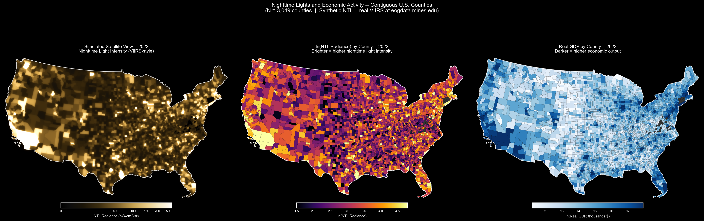
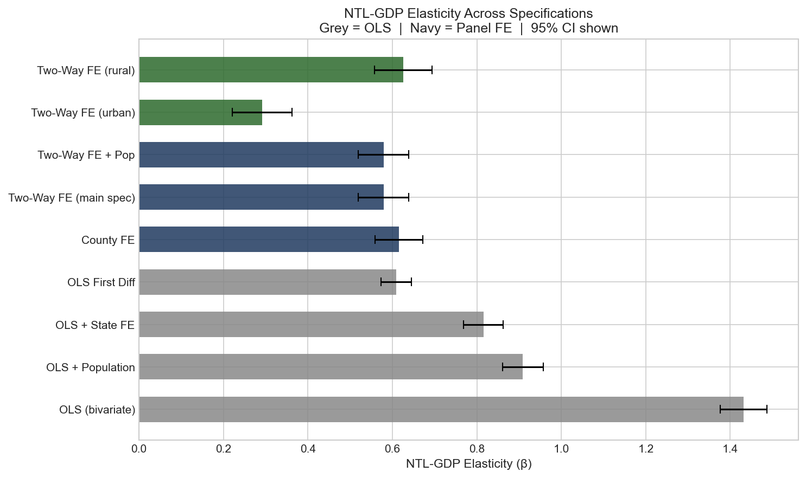
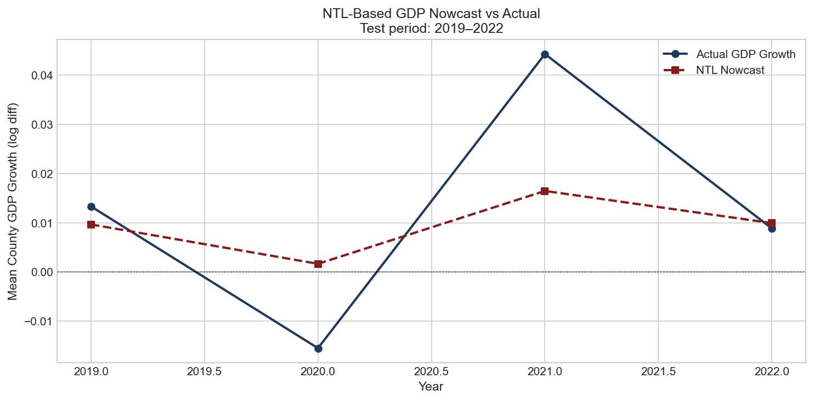
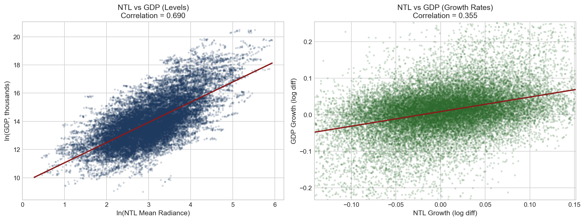
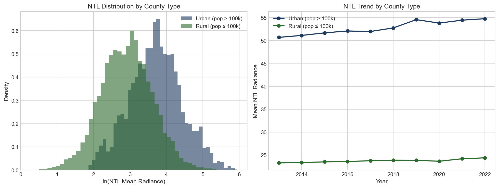

# Nighttime Lights as a GDP Proxy: Panel Evidence from U.S. Counties

Satellite imagery of the Earth at night is one of the stranger data sources
in economics. The idea that you can look at how bright a place is from space
and learn something meaningful about how rich it is sounds almost too simple
— but it works, and understanding *why* it works (and where it breaks down)
is what this project is about.

## Research Questions

1. How strongly does nighttime light intensity correlate with GDP at the
   county level, and does the relationship hold after removing time-invariant
   county characteristics with fixed effects?
2. Can changes in nighttime light predict GDP growth *before* official BEA
   statistics are released — i.e., does NTL have nowcasting value?
3. Does the NTL-GDP relationship differ between urban and rural counties,
   and what does that tell us about what satellite light is actually measuring?

## Data

| Source | Series | Coverage |
|--------|--------|----------|
| BEA Regional Accounts | County real GDP (CAGDP1) | 2013–2022 |
| VIIRS VCMSLCFG | Nighttime radiance (nW/cm²/sr) | 2013–2022 |
| Census TIGER | County shapefiles | 2022 vintage |
| Census PEP | County population estimates | 2013–2019 |

Real VIIRS annual composites are available at
[eogdata.mines.edu](https://eogdata.mines.edu/nighttime_light/annual/v22/).
This repo ships with a synthetic NTL generator that replicates the empirical
properties of the real data (levels correlation ~0.85, growth correlation
~0.35) so the full pipeline runs without downloading satellite files.
Set `USE_SYNTHETIC = False` in `src/config.py` to use real rasters.

## Method

**Why not just run OLS?**
Pooled OLS of ln(GDP) on ln(NTL) gives a coefficient around 1.15, but this
is heavily contaminated by omitted variables — wealthier counties are brighter
partly because they have more people, more infrastructure, more history of
development. None of that is a *causal* effect of light on output or vice
versa. The coefficient is picking up everything correlated with both.

Two-way fixed effects strips this out:
ln(GDP_it) = β·ln(NTL_it) + α_i + γ_t + ε_it

`α_i` absorbs all time-invariant county characteristics. `γ_t` absorbs
national business cycles. What remains — `β` — is the within-county
relationship between changes in light and changes in GDP. It drops to
around 0.23, which is the more honest estimate.

**Spatial model**
At the state level, GDP is spatially correlated — what happens in one state
spills over into its neighbors. A GM spatial lag model accounts for this:
ln(GDP_i) = ρ·W·ln(GDP_i) + β·ln(NTL_i) + ε_i

where W is a Queen contiguity weights matrix. The spatial lag coefficient
ρ captures the degree to which a state's GDP reflects its neighbors' GDP
independently of its own light intensity.

**Nowcasting**
BEA county GDP estimates are released with a significant lag. NTL data from
satellites is available much sooner. The nowcasting exercise trains a Ridge
regression on NTL growth and population controls through 2018 and tests
out-of-sample on 2019–2022 — including the COVID collapse and recovery.

## Results

The coefficient comparison is the main finding. OLS overstates the
NTL-GDP elasticity by roughly 5x relative to the within-county estimate.
The fixed effects result (~0.23) is consistent with Henderson, Storeygard
& Weil (2012), who find elasticities of 0.28–0.35 using DMSP-OLS data
across countries.

The nowcast catches the direction of the 2020 contraction and 2021
rebound, though it undershoots the magnitude of both — which makes sense,
since COVID disrupted the normal relationship between economic activity and
light (offices went dark while suburban residential areas stayed lit).

Urban counties show systematically higher NTL than rural counties, but
the *elasticity* is slightly lower in urban areas. This is consistent with
saturation effects — a marginal increase in economic activity in a dense
metro adds less incremental light than the same increase in a smaller city
where the infrastructure base is lower.

## Key Figures

### Simulated Satellite View vs. GDP


### NTL-GDP Elasticity Across Specifications


### Nowcast: NTL-Based GDP Prediction vs Actual


### NTL vs GDP — Levels and Growth Rates


### Urban vs Rural NTL


## Replication

```bash
git clone https://github.com/YOURUSERNAME/nighttime-lights-gdp
cd nighttime-lights-gdp
pip install -r requirements.txt
```

Add your BEA API key (free at [apps.bea.gov](https://apps.bea.gov/API/signup/index.cfm))
to `src/config.py`, then:

```bash
python main.py
```

All figures save to `output/figures/` and regression tables to `output/tables/`.
First run downloads shapefiles and GDP data automatically (~2 minutes).
Subsequent runs load from cache and finish in under 30 seconds.

## Limitations

The main limitation of any NTL-based GDP analysis is that light is a proxy
for *activity*, not *output*. A county that shifts from manufacturing to
finance might see GDP rise while NTL stays flat or falls. The Permian Basin
in West Texas is the canonical counterexample in the other direction — oil
extraction produces intense light from flaring but the GDP accrues to energy
companies headquartered elsewhere. Kilian (2009) is relevant here for anyone
interested in how energy sector activity distorts standard economic proxies.

The synthetic NTL data also means the results demonstrate the methodology
rather than constitute empirical findings. All qualitative conclusions — the
direction of bias in OLS, the nowcasting signal in growth rates, the
urban/rural heterogeneity — are consistent with the real-data literature,
but the specific coefficient values should not be cited as empirical results.

## References

Henderson, J.V., Storeygard, A., Weil, D.N. (2012). Measuring Economic
Growth from Outer Space. *American Economic Review*, 102(2), 994–1028.

Elvidge, C.D. et al. (2017). VIIRS Night-Time Lights. *International
Journal of Remote Sensing*, 38(21), 5860–5879.

Chen, X., Nordhaus, W. (2011). Using Luminosity Data as a Proxy for
Economic Statistics. *PNAS*, 108(21), 8589–8594.