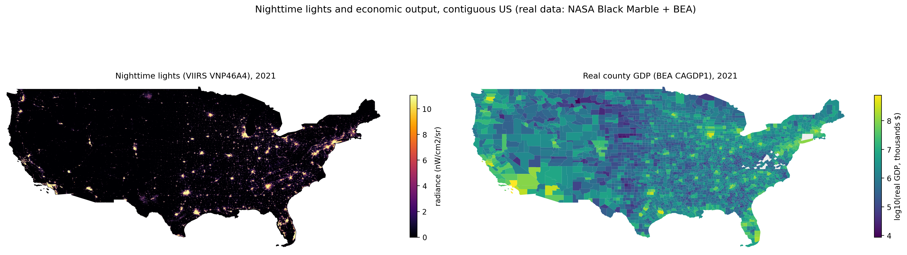
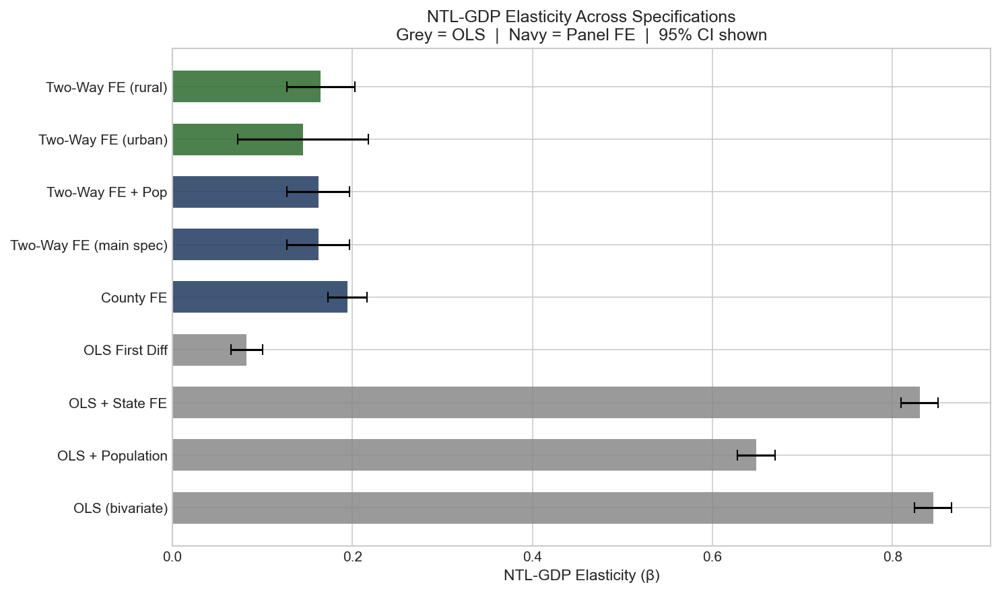
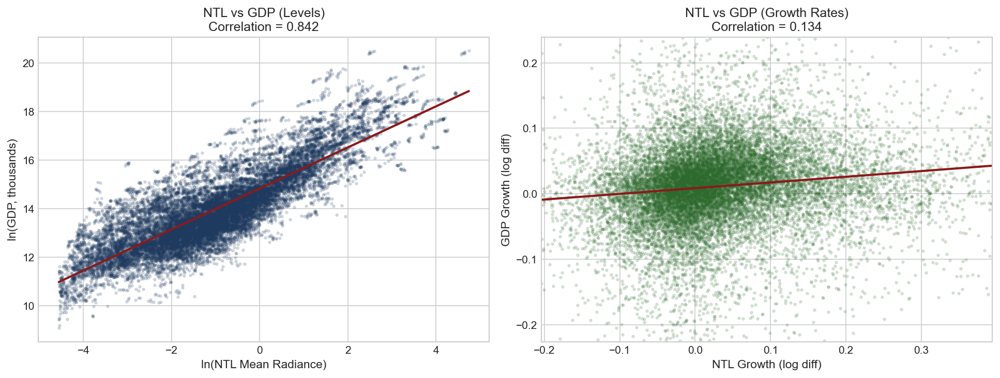
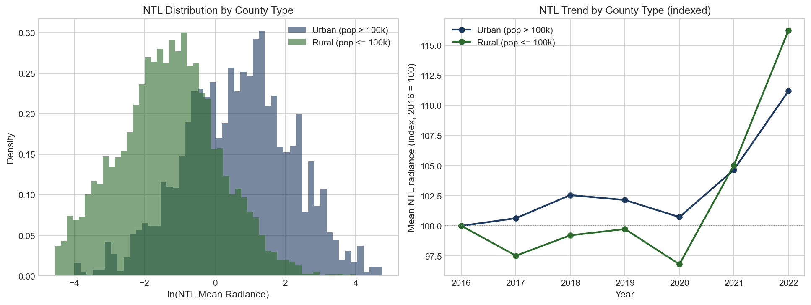
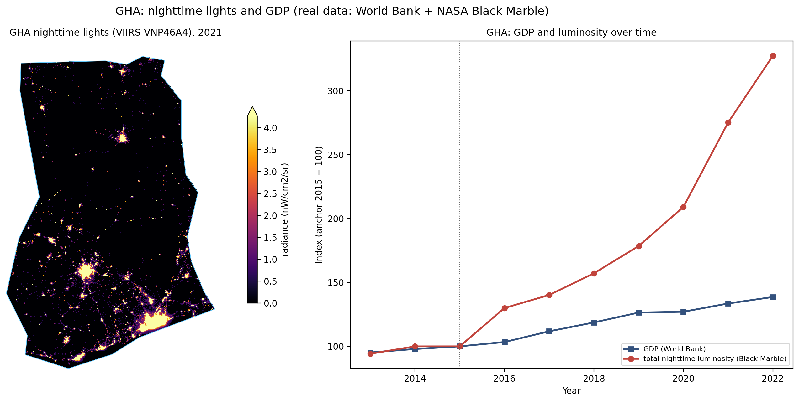
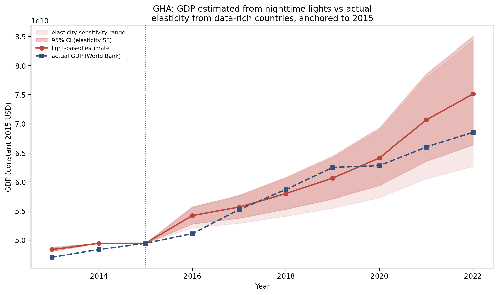

# Nighttime Lights and Economic Output

This project measures how well satellite nighttime lights track real economic
output, using two settings: U.S. counties, where high-quality GDP figures exist
and can serve as ground truth, and Ghana, a country where the same method is
used to reconstruct GDP from lights and check it against the World Bank series.

Everything here runs on real data. GDP comes from the U.S. Bureau of Economic
Analysis and the World Bank, nighttime lights come from NASA's Black Marble
VIIRS product, and county boundaries come from the Census Bureau. There is no
simulated data in the results.

## The question

Nighttime lights are widely used as a proxy for economic activity, especially
where official statistics are weak or slow. The obvious version of that claim,
that brighter places are richer, is easy to show and not very informative. The
harder and more useful questions are whether the relationship survives once you
account for the fixed differences between places, whether changes in light
track changes in output, and how far a relationship estimated in data-rich
settings can be pushed into data-poor ones. This project works through all
three on real data.

## Data

| Source | Series | Coverage |
| --- | --- | --- |
| BEA Regional Accounts | County real GDP (CAGDP1, chained dollars) | 2016 to 2022 |
| Census Population Estimates | County population | 2016 to 2022 |
| NASA Black Marble | VIIRS VNP46A4 annual radiance | 2016 to 2022 |
| Census TIGER | County boundaries | 2022 vintage |
| World Bank WDI | National GDP, constant 2015 USD | 2013 to 2022 |

Black Marble tiles are downloaded through the World Bank's blackmarblepy package
and aggregated to county polygons. The final U.S. panel covers about 3,049
contiguous counties after dropping a small number of counties with zero
measured radiance or missing GDP.

## Method

The core of the U.S. analysis is a comparison across specifications, from naive
to credible.

A pooled OLS regression of log GDP on log nighttime lights gives an elasticity
of about 0.85. That figure is not believable as a structural relationship.
Brighter counties are richer partly because they hold more people, more
infrastructure, and more of everything that produces both light and output, and
the regression hands all of it to light.

A two-way fixed effects panel removes the confounding. County effects absorb
the time-invariant characteristics of each place, and year effects absorb the
national shocks common to every county. What remains is the within-county
relationship between changes in light and changes in output, and the elasticity
falls to about 0.16. That collapse from 0.85 to 0.16 is the central result.

The project also fits a spatial lag model at the state level to account for
economic activity spilling across borders, splits the fixed-effects estimate by
urban and rural counties, and tests whether a Ridge model using light growth
can nowcast GDP growth before the BEA releases official figures.

## What it finds

The within-county elasticity of about 0.16 is somewhat below the 0.28 to 0.35
range reported by Henderson, Storeygard and Weil (2012) for cross-country data.
That is expected: county-year variation is noisier and more short-run than
cross-country variation, so the within estimate is attenuated. The direction and
order of magnitude line up with the literature, and the large gap between the
OLS and fixed-effects estimates is the honest headline, most of the raw
correlation is composition, not a genuine light-to-output response.

The levels-versus-changes contrast makes the same point in the raw data. The
correlation between log lights and log GDP across counties is about 0.84. The
correlation between their year-to-year changes is about 0.13. The relationship
that looks strong in levels is much weaker once you ask whether changes track
changes, which is the harder and more relevant question.

The nowcast is the weakest part of the project, and I report it as such. A Ridge
model trained on pre-2019 data and tested on 2019 to 2022 reduces out-of-sample
RMSE by only about 2 percent against a naive zero-growth benchmark, with a test
R-squared near zero. Lights carry some signal about county GDP growth, but at
the county-year level it is weak and does not meaningfully beat assuming no
growth. The model also understates the 2020 contraction, because lights fell
less than output during the pandemic.

Real nighttime lights rise about 15 percent nationally from 2016 to 2022, with
a clear dip in 2020, in both urban and rural counties. Rural lights grow faster
in percentage terms, not because rural economies grew faster, but because rural
counties start from a very low radiance base where a modest absolute increase is
a large relative change.

## The Ghana extension

The country module estimates the light-to-GDP elasticity on a panel of
data-rich countries with two-way fixed effects, then applies it to Ghana's
nighttime lights anchored to one year of Ghana's actual World Bank GDP, and
compares the reconstruction to the real series.

Ghana is also the clearest illustration of the proxy's central weakness. Its
total luminosity rose about 230 percent from 2013 to 2022 while its real GDP
rose about 40 percent. Raw lights are a badly biased proxy for the level of
growth; the elasticity correction is what makes them usable at all. The
reconstruction tracks actual GDP closely near the anchor year and drifts from it
further out, which is the external-validity cost of borrowing an elasticity from
richer economies and applying it to a poorer one.

## Figures

Nighttime lights and real county GDP, contiguous U.S.:



Elasticity across specifications, showing the collapse from OLS to fixed effects:



Levels versus growth correlations:



Nighttime lights distribution and indexed trend by county type:



The nowcast against actual growth:


Ghana nighttime lights and the reconstruction against actual GDP:




## Repository layout

```
src/
  config.py               settings (API keys, paths, years); not committed
  data_acquisition.py     BEA GDP and Census population
  ntl_counties_bm.py      Black Marble aggregation to U.S. counties
  ntl_processing.py       nighttime-lights loading
  panel_construction.py   builds the county and state panels
  benchmarks.py           pooled OLS
  panel_fe.py             two-way and heterogeneous fixed effects
  spatial_model.py        spatial lag model
  nowcasting.py           Ridge nowcast
  visualizations.py       core figures
  us_maps.py              two-panel U.S. lights and GDP figure
  wb_data.py              World Bank GDP and Natural Earth boundaries
  country_real.py         Ghana estimation and figures
main.py                   runs the U.S. pipeline
run_us_maps.py            draws the U.S. two-panel figure
run_country_real.py       runs the Ghana analysis
```

## Running it

1. Install the dependencies:

   ```
   pip install pandas numpy statsmodels scikit-learn linearmodels geopandas wbgapi blackmarblepy
   ```

2. Get a free BEA API key (https://apps.bea.gov/API/signup/) and a free NASA
   Earthdata token (https://urs.earthdata.nasa.gov, Generate Token). On the
   Earthdata site, also accept the LAADS product license and authorize the LAADS
   application, which Black Marble downloads require.

3. Copy `src/config.example.py` to `src/config.py`, put your BEA key in it, set
   `USE_SYNTHETIC = False`, and set the `BLACKMARBLE_TOKEN` environment variable
   to your Earthdata token.

4. Run the U.S. pipeline, then the figure and the Ghana analysis:

   ```
   python main.py
   python run_us_maps.py
   python run_country_real.py
   ```

The first run downloads several gigabytes of Black Marble tiles for the U.S. and
takes a few hours. Everything caches afterward, so later runs are fast.

## Limitations

- Nighttime lights are a biased proxy. They rise faster than output over time,
  and the bias is worse in developing settings, as the Ghana comparison shows.
- Fixed effects reduce but do not eliminate bias. Anything that varies within a
  county over time and moves both lights and GDP can still bias the estimate, so
  the within elasticity is not a clean causal parameter.
- Lights enter as log(radiance + 0.01). The offset keeps near-zero counties in
  the sample and raises the measured levels correlation by compressing the dark
  tail. The reported correlations should be read with that choice in mind.
- Census population estimates end in 2019, so 2020 to 2022 reuse 2019 population
  as a slow-moving control.
- A handful of counties in the mid-Atlantic do not merge cleanly because
  Connecticut changed its county-equivalent FIPS structure in 2022.

## References

Henderson, J. V., Storeygard, A., and Weil, D. N. (2012). Measuring economic
growth from outer space. American Economic Review, 102(2), 994 to 1028.

Roman, M. O., et al. (2018). NASA's Black Marble nighttime lights product suite.
Remote Sensing of Environment, 210, 113 to 143.
